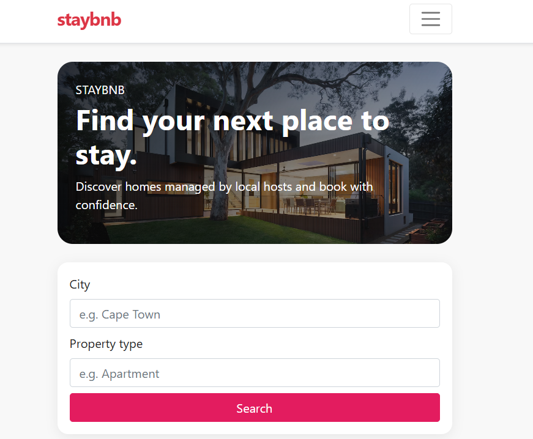
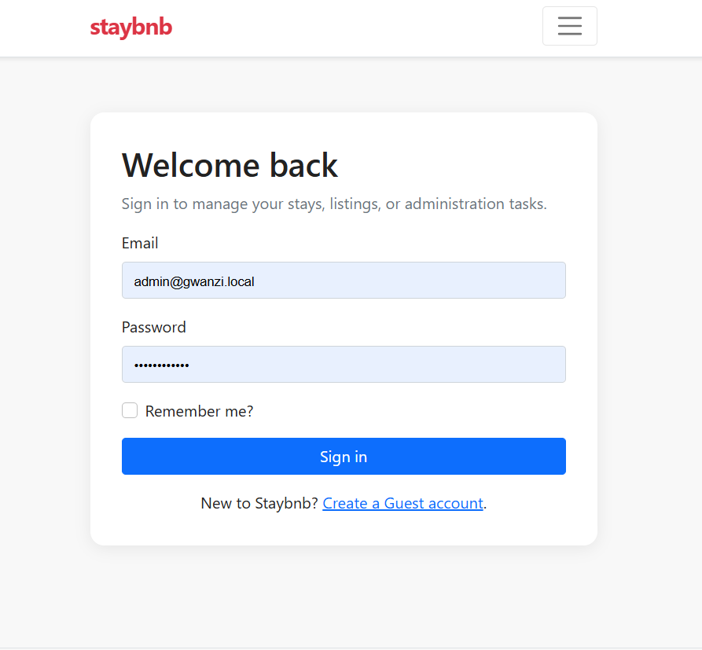
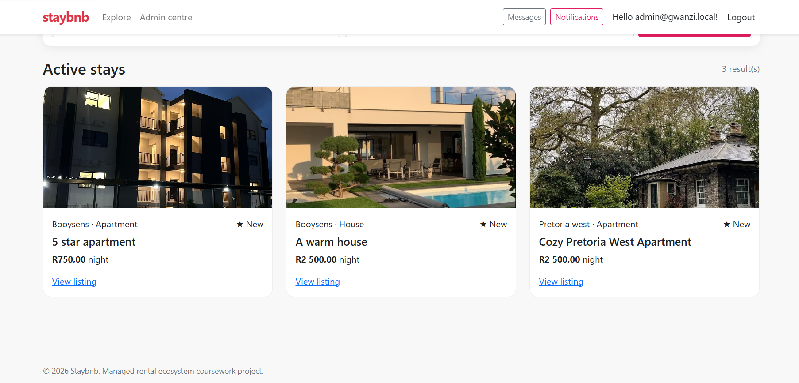
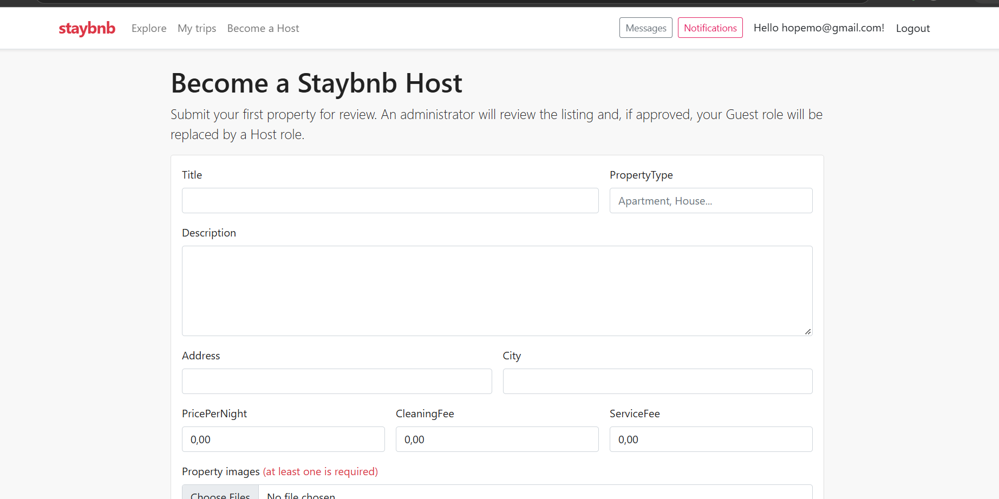
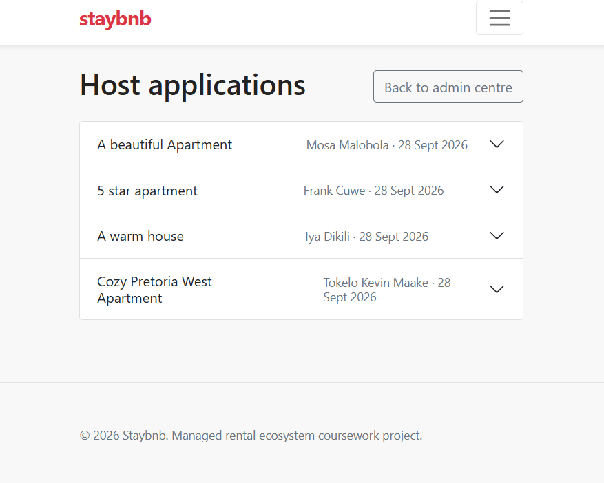
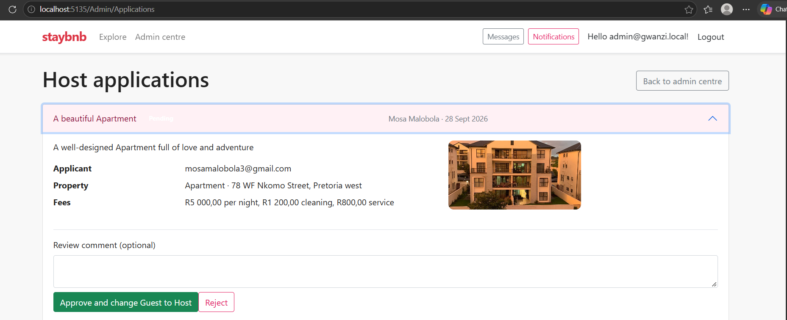
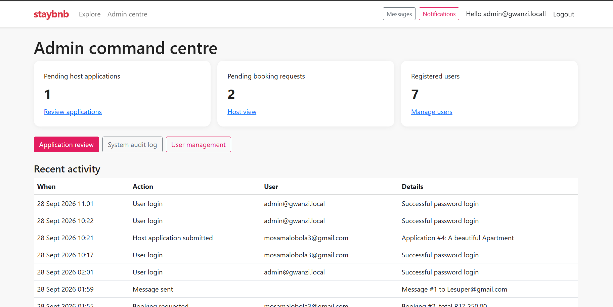

# Staybnb — ASP.NET Core MVC Property Rental Ecosystem

**Staybnb** is a complete ASP.NET Core MVC coursework project implementing a managed property-rental ecosystem. It uses ASP.NET Core Identity, role-based authorization, EF Core, SQL Server, Razor Views, file uploads, database-backed messaging, notifications, and an activity audit log.

> New registrations are assigned **Guest** automatically. An approved host application programmatically adds **Host** and removes **Guest**, so the two role-specific dashboard areas remain mutually exclusive.

## Requirements Covered

| Assignment area | Implementation location | Behaviour delivered |
|---|---|---|
| Identity and role evolution | `Areas/Identity/Pages/Account/Register.cshtml.cs`, `Services/MarketplaceServices.cs`, `Controllers/AdminController.cs` | New users receive `Guest`; startup creates roles and a `SuperAdmin`; approval changes Guest to Host. |
| Hosting workflow | `Controllers/HostingController.cs`, `Controllers/HostController.cs` | Image-required property application, listing visibility control, booking review, and check-in configuration. |
| Guest experience | `Controllers/HomeController.cs`, `Controllers/GuestController.cs` | Active-property browsing/filtering, booking request, server-side price calculation, and document upload. |
| Administration | `Controllers/AdminController.cs` | Application review, audit log, and SuperAdmin-only Guest-to-Admin promotion. |
| Communication and auditability | `Controllers/MessagesController.cs`, `Controllers/NotificationsController.cs`, `Services/MarketplaceServices.cs` | Database inbox, notifications with read status, and activity records for key actions. |
| EF Core architecture | `Data/ApplicationDbContext.cs`, `Data/Migrations`, `StaybnbDb.sql` | SQL Server entity mappings, relationships, generated migration, and idempotent SQL script. |

## Prerequisites

Install the following before running the system.

| Component | Recommended version |
|---|---|
| .NET SDK | .NET 8 SDK |
| SQL Server | SQL Server Express, Developer, LocalDB (Windows), or a reachable SQL Server instance |
| IDE | Visual Studio 2022, Rider, or Visual Studio Code with C# Dev Kit |

## Configure SQL Server

Edit `appsettings.json` and replace `DefaultConnection` with a connection string that is valid for your machine. For example, SQL Server Express on Windows may use:

```json
"DefaultConnection": "Server=.\\SQLEXPRESS;Database=StaybnbDb;Trusted_Connection=True;TrustServerCertificate=True;MultipleActiveResultSets=true"
```

For SQL Server authentication, use a connection string similar to:

```json
"DefaultConnection": "Server=localhost,1433;Database=StaybnbDb;User Id=sa;Password=YourStrongPassword!;TrustServerCertificate=True;MultipleActiveResultSets=true"
```

The development values in `appsettings.json` are placeholders. Change `SeedAdmin:Password` before any real deployment.

## Run the Project

The application calls `Database.MigrateAsync()` at startup, so the generated migration is applied automatically when the connection is valid. From the project directory, run:

```bash
dotnet restore
dotnet run
```

Alternatively, use Visual Studio, set **Staybnb** as the startup project, and select **Run**. Navigate to the local URL shown in the terminal or Visual Studio output.

If database migrations need to be executed manually, run:

```bash
dotnet ef database update
```

If the EF Core command-line tool is not installed, install it with:

```bash
dotnet tool install --global dotnet-ef --version 8.0.30
```

## Seeded SuperAdmin

On the first successful startup, the role seeder creates all four application roles and this account:

| Field | Development value |
|---|---|
| Email | `superadmin@staybnb.local` |
| Password | `ChangeThis!123` |
| Role | `SuperAdmin` |

Change these values in `appsettings.json` for your submission demonstration if you need different credentials. Do not use the sample password outside a local demonstration environment.

## Suggested Demonstration Script

1. Register a new account. Confirm it starts as **Guest** and can access **My trips** and **Become a Host**.
2. As the Guest, submit a host application containing all property data and at least one image. Try submitting without an image to demonstrate validation.
3. Sign in as `superadmin@staybnb.local`. In **Admin centre → Application review**, approve the request.
4. Sign back in as the applicant. Confirm **Host dashboard** is now available and **My trips** is no longer accessible due to role authorization.
5. Register a second Guest. Browse the active property, request booking dates, and note the calculated booking total.
6. As Host, approve the booking and configure a check-in process. As Guest, upload an ID/passport document; as Host, verify it. Confirm the booking progresses through `Pending → Approved → CheckedIn`.
7. Send a message between users and inspect notifications. Review **Admin centre → System audit log** to demonstrate workflow logging.
8. As SuperAdmin, open **User management**, search a Guest, and promote the account to Admin.

## Project Layout

```text
Staybnb/
├── Areas/Identity/Pages/Account/     # Custom registration assigning Guest role
├── Controllers/                      # Discovery, Guest, Host, Admin, messages, notifications
├── Data/                             # EF Core context and generated migrations
├── Models/                           # Identity user, entities, enums, view models
├── Services/                         # Role seeder, uploads, audit and notification services
├── Views/                            # Razor screens grouped by MVC controller
├── wwwroot/uploads/                  # Runtime storage for property and guest-document files
├── StaybnbDb.sql                     # Idempotent SQL Server migration script
└── README.md                         # Setup and demonstration instructions
```

## Validation Performed

The supplied source has been compiled with `dotnet build` after creating the migration, with **0 warnings and 0 errors**. An idempotent EF Core SQL Server script was also generated successfully from the migration. A live end-to-end run requires a SQL Server instance configured through `appsettings.json`.

## Important Submission Notes

Do not submit `bin/` or `obj/` folders; they can be rebuilt from source and unnecessarily increase the archive size. Before uploading to Moodle, test the solution against a local SQL Server instance and ensure no real identity documents are left in `wwwroot/uploads/documents`.


## Screenshots















